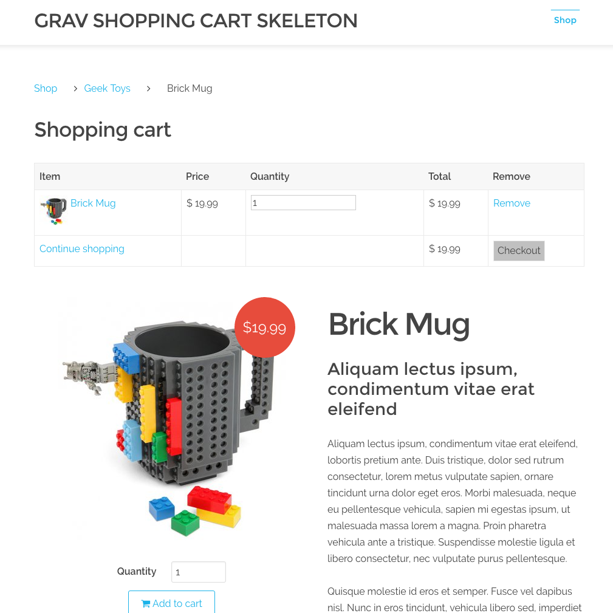

# Grav Shopping Cart Skeleton

The *Shop Shopping Cart* skeleton is a [Grav](http://github.com/getgrav/grav) skeleton and includes a *user* folder giving an example of a native Grav Shopping Cart set up using Grav.

# Installation

To install this package, you will essentially be replacing the default `user` folder with the skeleton. To do this, download the zip version of this repository and unzip it under `/your/site/grav/`. Then, rename the folder to `user`.

If a user folder already exists, back up the folder to a safe place, delete it (if there is no custom content in it you wish to keep) or replace its contents with the files in the unzipped folder.

You should now have all the skeleton files under

	/your/site/grav/user/

>> NOTE: This skeleton is a modular component for Grav which requires [Grav](http://github.com/getgrav/grav) and several plugins to be installed, plus the Antimatter theme. If you download this skeleton from GitHub directly, make sure you run `bin/grav install`.